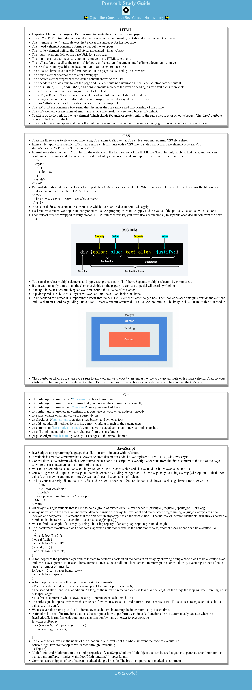

# Prework Study Guide Webpage

## Description

This project was built as a pre-work to my 16-week front-end web development boot camp, during which I learned the basics of HTML, CSS, JavaScript, and Git. As a student of computer systems analysis and development, my intention with this course is to improve my computational logic skills and learn a new programming language, to build a solid web page based on the concepts of user experience design.

## Deployed site

https://vanessadantonio.github.io/prework-study-guide/

## Installation

N/A

## Usage

To use this Prework Study Guide, you can review the notes in each section. For suggestions on what to study first, open the Chrome DevTools by pressing Command+Option+I (macOS) or Control+Shift+I (Windows). A console panel should open either below or to the side of the webpage in the browser. There you will see a list of topics we learned from the prework along with a suggestion on which topic to study first.

## Credits

N/A

## License

Please refer to the LICENSE in the repo.
